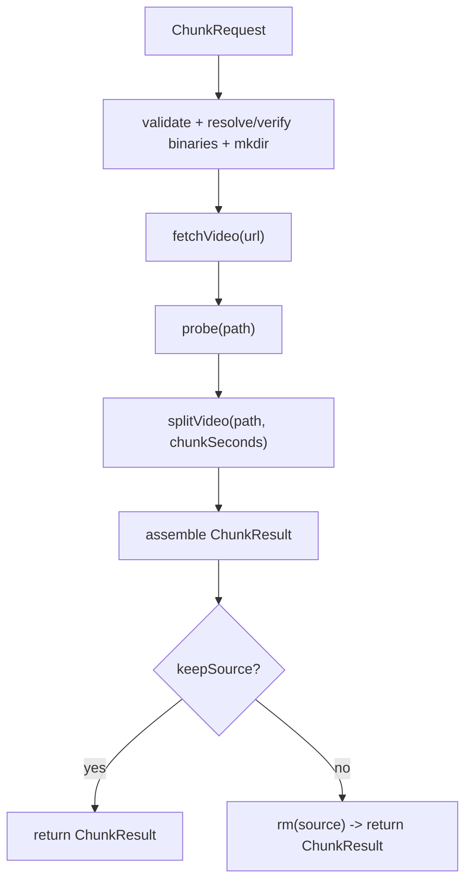

# @ytutils/video-chunker

Core workflow: a YouTube URL in, fixed-length
chunks out.



<details>
<summary>flow details</summary>

- `fetchVideo(url)` returns `FetchedSource { path, title }`.
- `probe(path)` returns `MediaInfo { durationSeconds, sizeBytes }`.
- `Source { path, title, durationSeconds, sizeBytes }` is built by merging fetch
  and probe results.
- `splitVideo(path)` produces `Chunk[]` through:
  - `runFfmpeg` (writes chunk files and segment manifest)
  - `manifestFilenames` (reads filenames from manifest)
  - `collectChunks` (probes each chunk for `durationSeconds` and `sizeBytes`)
- `ChunkResult` contains `{ source, chunks, outDir }`.
</details>

## run()

```ts
import { run } from '@ytutils/video-chunker'

const result = await run(
  { url, chunkSeconds: 3600, outDir: './output' },
  { onProgress: (e) => e.type === 'chunk' && console.log(e.chunk.index) }
)
console.log(result.chunks.length)
```

Core deals in raw numbers (seconds, bytes). Formatting into MB / `HH:MM:SS`
lives in the CLI. `run()` validates the request, verifies that binaries exist
_before_ downloading, runs fetch → probe → split, and (unless `keepSource`)
removes the full download once it has been split.

## The event stream

`run()` reports through one typed `onProgress` callback carrying `RunEvent`s,
with `percent` already computed where a total is known:

| event            | carries                                       |
| ---------------- | --------------------------------------------- |
| `stage:start`    | `stage` (`fetch` / `probe` / `split`)         |
| `fetch:progress` | `percent`, `receivedBytes`, `totalBytes`      |
| `probed`         | `source: Source`                              |
| `split:progress` | `percent`, `processedSeconds`, `totalSeconds` |
| `chunk`          | `chunk: Chunk` (emitted as each one lands)    |
| `stage:done`     | `stage`                                       |

Errors are `VideoError` with a `code` (`VideoErrorCode`). See `src/events.ts` and
`src/errors.ts` for the exact shapes.

## Composing your own workflow

`run()` is just a convenience over three plain operations. When you need a
different shape, your own ordering, a step in between, a different sink, call
them directly. There is no workflow object to adopt and no context to satisfy:

```ts
import { fetchVideo, probe, splitVideo } from '@ytutils/video-chunker'

const { path } = await fetchVideo(url, { outDir: './work' })
const { durationSeconds } = await probe(path)
const chunks = await splitVideo(path, { outDir: './work', chunkSeconds: 3600 })

for (const chunk of chunks) {
  await transcribe(chunk.path) // your own step, without run() constraints
}
```

Each operation takes its primary input positionally and an options object, and
reports only what its tool knows: `fetchVideo` emits `{ receivedBytes,
totalBytes }`, `splitVideo` emits `{ processedSeconds }` and an `onChunk`
callback. Deriving `percent` is the caller's job (`run()` does it for you).

## The vocabulary

Durations are seconds, sizes are bytes; presentation units never appear in core.
The shared types live in `src/media.ts`:

- `ChunkRequest`, what `run()` is asked to do (`url`, `chunkSeconds`,
  `outDir`, optional `cookies` / `keepSource`). No defaults live here; callers
  pass explicit values.
- `FetchedSource` → `MediaInfo` → `Source`, a download, its
  measurements, and the two merged.
- `Chunk`, one output segment on disk (`index`, `path`, `durationSeconds`,
  `sizeBytes`).
- `ChunkResult`, `run()`'s output: the `source`, every `chunk`, and the
  `outDir` they landed in.

The split uses ffmpeg's segment muxer with `-c copy`, so cuts land on the
nearest keyframe before each target time, a chunk's real length is
approximately, not exactly, `chunkSeconds`. Files written are learned from
ffmpeg's `-segment_list` manifest, never by scanning the directory, so a
previous run's leftover chunks can't leak into this run's result.
